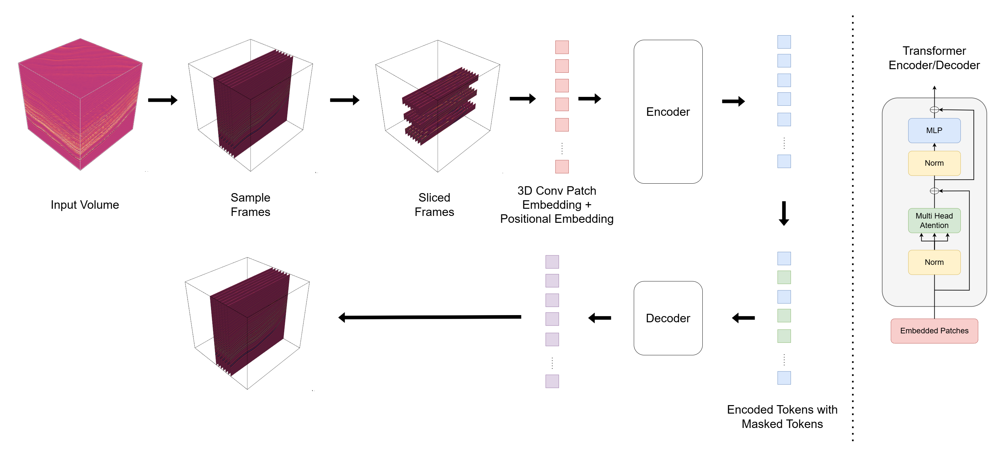

# 3D Representation Learning for Interpolation with Masked Autoencoder

## Dataset : https://thinkonward.com/app/c/challenges/patch-the-planet

## Data Prearation
Please follow the instructions in DATASET.md for data preparation.

## Results

## Acknowledgements
This project is built upon [MAE-pytorch](https://github.com/facebookresearch/mae), [VideoMAE](https://github.com/MCG-NJU/VideoMAE) and [SeismicFoundationModel](https://github.com/shenghanlin/SeismicFoundationModel)
## License

The majority of this project is released under the CC-BY-NC 4.0. Portions of the project are available under separate license terms: pytorch-image-models is licensed under the Apache 2.0 license.
